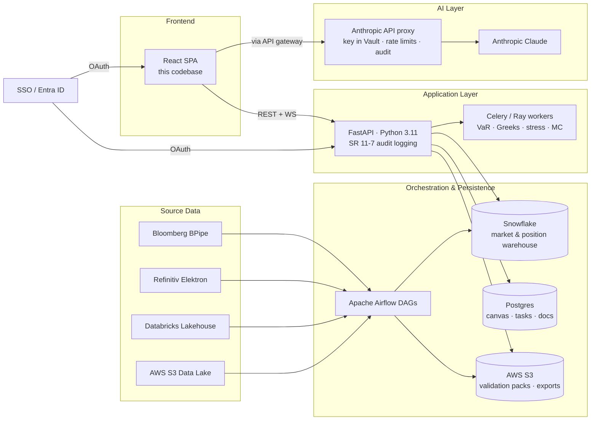

# RiskFlow Studio

A client-side risk modeling workbench for designing model lifecycles, computing portfolio
risk, running stress scenarios, and producing documentation with AI assistance. Single-page
React app — no backend, runs locally with `npm run dev`. Ships with realistic mock data so
it works on first open, and accepts CSV/Excel uploads to demonstrate reusability against
real positions.

## What this is for

This app is a deliverable for a **State Street Risk Modeling Process Designer / Analyst**
interview, Enterprise Risk Management group. Every tab is anchored to a specific
responsibility or technology in the job description. The goal is to demonstrate that the
work described in the JD can be done end-to-end in a tool, not just talked about — process
design, risk metrics (Greeks / VaR / stress testing), data ingestion, AI-assisted
documentation, project & UAT tracking, production monitoring, and a Confluence-lite docs
repo.

## Quickstart

```bash
npm install
npm run dev
```

Open <http://localhost:5173>.

To use the **AI Co-Pilot** tab: click **Settings** at the bottom of the sidebar, paste your
Anthropic API key, click **Test connection**. The key is stored in `localStorage` on this
machine only and is sent to `api.anthropic.com` directly from the browser. See
[Caveats](#caveats--known-limitations) for the production posture.

## Features by tab

| Tab | What it does | JD anchor |
|---|---|---|
| **Process Canvas** | Visual designer for the full lifecycle of a risk model (Data Ingestion → Model Development → Validation → UAT → Production → Monitoring → Decommission). Each stage carries owner, inputs, outputs, SLA, description; pre-loaded with a realistic VaR-model lifecycle with State Street stakeholders (Quant Team, MRM, Market Data Ops, Risk Production). Export current design as JSON. | "Lead the risk modeling process design by interacting with model developers, model owners, source data providers, and downstream process owners." |
| **Risk Metrics** | Portfolio summary (notional / MTM / position count), VaR at 95% and 99% via three methods (Historical, Parametric, Monte Carlo) with Recharts mini-distributions, full Black-Scholes Greeks per position with portfolio totals, and stress testing with 2008 GFC / 2020 COVID / 2022 rate-shock presets plus live custom shocks. Math is hand-rolled in `src/lib/risk.js` with formulas cited in comments — no QuantLib / mathjs / jstat. | "Solid understanding of risk measures: Greeks, VAR, Stress Testing, market data and data vendors." |
| **Data Hub** | Source-data architecture diagram (Bloomberg, Refinitiv, Databricks, Snowflake, AWS S3 → Ingestion → RiskFlow). CSV/Excel upload with column-type inference, required-column validation (`symbol/quantity/price`, case-insensitive), missing-value and z-score outlier flags. Uploaded data swaps in as the active portfolio for Risk Metrics. | "Source data providers; market data modeling; cloud tools (Databricks / Snowflake / AWS / Azure)." |
| **AI Co-Pilot** | Four opinionated, anchored Claude actions: **Generate Process Design Document**, **Generate Operational Manual**, **Identify Process Bottlenecks** (each reads the canvas), and **Auto-generate UAT Test Cases** (from a free-text model spec). Output is rendered Markdown; saves cleanly into the Docs Repo. System prompts cite SR 11-7 and Basel where relevant and force anchored, non-generic content. | "Leveraging AI capabilities; produce modeling process design documents and operational manual; modeling process automation." |
| **Project & UAT** | JIRA-lite kanban (To Do / In Progress / UAT / Done) with click-to-move arrows, filters by model / owner / status, and a side panel for editing tasks plus inline-editable UAT case tables (scenario / expected / actual / pass-fail). 12 realistic project cards seeded — Vega Greek discrepancy on long-dated SPX, SR 11-7 Credit VaR validation, Snowflake schema migration, decommission of legacy Parametric VaR. | "Project planning, implementation, issue, remediation, UAT test case creation, progressive status tracking." |
| **Production Monitor** | Health tiles for 6 model engines with Basel traffic-light coloring (green ≤4 / amber 5-9 / red ≥10 exceptions). 250-day backtest chart of portfolio VaR(99) vs realized P&L with exception markers. 7 mock alerts spanning info/warn/critical, each with a Markdown runbook (Bloomberg status pages, Snowflake SQL, on-call extensions, Basel III §718.94 citations). | "Support modeling production problem-solving in real time." |
| **Docs Repo** | Confluence-lite. Sidebar list with type badges (Process Design / Ops Manual / Bottleneck Analysis / UAT Cases / Manual). Rendered Markdown view with edit toggle, inline-editable title, export as `.md`, delete with confirm. Receives saves from AI Co-Pilot end-to-end. | "Produce modeling process design documents and operational manual." |

The **Settings** panel handles the Anthropic API key with a test-connection ping and a
"Reset all data" that wipes the `riskflow:*` localStorage namespace.

## Tech stack rationale

| Choice | Why |
|---|---|
| **React 18 + Vite 5** | Fast iteration, instant HMR, zero config bikeshedding. The right default for a single-page demo where boot time and reload feel matter. |
| **JavaScript (not TypeScript)** | Keeps velocity. The codebase is small enough that runtime types do not become a maintenance problem in this scope. |
| **Tailwind CSS** | Utility classes co-locate styling with markup and match the dense "workbench" aesthetic without component-library lock-in. |
| **Recharts** | Solid React-native chart library for the VaR distributions and the backtest series. Code-split so it loads only on the two tabs that use it. |
| **Papaparse + xlsx** | Standard pair for CSV / Excel parsing in the browser. xlsx is dynamically imported so users who only upload CSV (or never upload) don't pay the ~370 KB cost. |
| **react-markdown + remark-gfm** | Renders AI-generated documents and runbooks. GFM specifically so the AI's UAT test case tables render correctly. |
| **No backend** | Everything is client-side. Lets the demo run anywhere with just `npm run dev`. The mock data files are the source of truth; localStorage is the user-modified state. |
| **No state library** (no Redux / Zustand / context bus) | `useState` covers every tab. localStorage is the cross-tab bus. The seven tabs are independent enough that a global store would be premature. |
| **No drag-and-drop library** | Click-to-move arrow buttons handle Kanban transitions. Better keyboard accessibility, no animation bugs, no library footprint. |
| **Direct browser → Anthropic** | One header (`anthropic-dangerous-direct-browser-access: true`) gets us to a fully functional AI demo with no proxy server. Production deployment would proxy through the API layer (see architecture below). |
| **`React.lazy` per heavy tab + dynamic `xlsx`** | Initial bundle is **71 KB gzipped**; Recharts and react-markdown live in shared async chunks; xlsx loads only on Excel upload. |

## Production architecture

This codebase is deliberately a self-contained client-side demo. A real deployment at
State Street would look more like this:



Mapping this codebase onto that architecture:

- **Process Canvas / Project & UAT / Docs Repo** — Postgres-backed CRUD endpoints under
  `/api/canvas`, `/api/tasks`, `/api/docs` with role-based access. The React UI changes very
  little; `lib/storage.js` becomes a thin REST client.
- **Risk Metrics** — `lib/risk.js` becomes a Python service running on Celery / Ray workers
  reading from Snowflake. The React UI shifts to thin presentation. Math is the same; the
  scaling story is workers, vectorization, and a real correlation matrix in the MC method.
- **Data Hub** — uploads land in S3 with virus scanning and schema validation. The
  ingestion DAGs in Airflow already do the bulk path from Bloomberg / Refinitiv /
  Databricks / Snowflake.
- **AI Co-Pilot** — Anthropic key moves to Vault. Calls go through a managed proxy that
  adds rate limiting, prompt-caching for repeated lifecycle inputs, audit logging, and PII
  redaction. The system prompts in `src/tabs/AICopilot.jsx` carry over verbatim.
- **Production Monitor** — tiles and alerts read from real APM (Datadog / Splunk) and the
  model exception tracker. Runbooks live in Confluence and are linked, not stored.

## File structure

```
.
├── index.html
├── package.json
├── vite.config.js
├── tailwind.config.js
├── postcss.config.js
└── src/
    ├── main.jsx
    ├── App.jsx                       # tab router + Suspense boundary
    ├── index.css                     # Tailwind directives + :focus-visible
    ├── components/
    │   ├── Layout.jsx                # navy sidebar + main pane
    │   ├── Markdown.jsx              # react-markdown + remark-gfm
    │   ├── Settings.jsx              # API key + reset all data
    │   └── TabLoading.jsx            # Suspense fallback (150ms-delayed)
    ├── tabs/
    │   ├── ProcessCanvas.jsx
    │   ├── RiskMetrics.jsx           # lazy
    │   ├── DataHub.jsx
    │   ├── AICopilot.jsx             # lazy
    │   ├── ProjectUAT.jsx
    │   ├── ProductionMonitor.jsx     # lazy
    │   └── DocsRepo.jsx              # lazy
    ├── lib/
    │   ├── risk.js                   # PRNG, normCDF, BS Greeks, VaR x3, stress
    │   ├── parse.js                  # CSV (Papaparse) + Excel (xlsx, dynamic)
    │   ├── claude.js                 # fetch wrapper + typed ClaudeError
    │   └── storage.js                # namespaced localStorage helpers
    └── data/
        ├── defaultCanvas.js          # 7-stage VaR lifecycle
        ├── mockPositions.js          # 5 equities + 3 options + 2 IR swaps
        ├── mockMarket.js             # 252-day seeded returns per underlying
        ├── mockTasks.js              # 12 risk-modeling project cards
        └── mockMonitor.js            # health tiles + backtest series + alerts
```

## Caveats / known limitations

- **`xlsx` advisory.** `xlsx@0.18.5` from npm has unpatched advisories (prototype pollution,
  ReDoS). Accepted for this demo because files are uploaded into the user's own browser
  only — they never reach a server, so the attack surface is zero. A production deployment
  would use the SheetJS CDN tarball or move parsing to the API layer.
- **API key in `localStorage`.** The Anthropic key the user pastes into Settings is stored
  in browser `localStorage` and sent directly to `api.anthropic.com` from the page. This is
  acceptable on a personal demo machine. The production version would proxy AI calls through
  the API layer (see architecture above) so the key stays in a secrets manager and gets
  rate limiting, audit, and PII redaction.
- **Mock data.** Portfolio, market data, lifecycle, tasks, alerts, and runbooks are seeded
  mock content. Returns and Monte Carlo draws are deterministic (mulberry32 + symbol hash)
  so demo numbers are stable across reloads.
- **No real-time monitoring.** The Production Monitor tab simulates "live" feel via a
  Refresh button that re-jitters timestamps. There is no WebSocket, no polling, no real
  telemetry — the chart and alert state come from the mock data file.
- **No persistence beyond `localStorage`.** All user-edited state (canvas, tasks, docs,
  uploaded portfolio) lives in `localStorage` under the `riskflow:` namespace. Settings →
  **Reset all data** wipes it cleanly.
